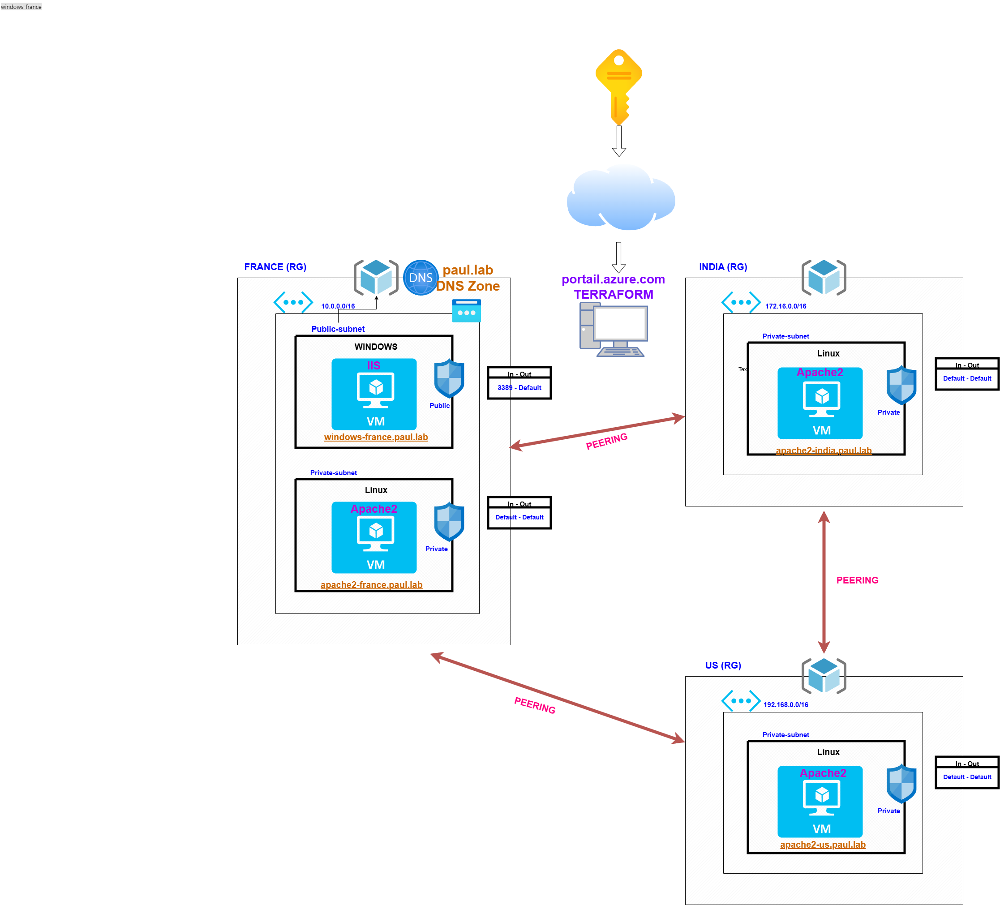

# Virtual Network Peering (3 Regions) + Private DNS Zone

> Deploy 3 virtual networks across different Azure regions, peer them together, and enable internal name resolution using a private DNS zone — all with Terraform!

---

## What does this project do?

This Terraform code automatically creates:

- **3 Resource Groups** in 3 Azure regions:  
  → `France Central`, `East US`, `Central India`
- **3 Virtual Networks (VNet)** with custom IP ranges:
  - France: `10.0.0.0/16`
  - US: `192.168.0.0/16`
  - India: `172.16.0.0/16`
- Each VNet has:
  - A **public subnet** (with RDP/HTTP access from internet)
  - A **private subnet** (no direct internet access)
- **Network Security Groups (NSG)**:
  - Public subnets: Allow RDP (3389) and HTTP (80)
  - Private subnets: No rules needed (default allows VNet-to-VNet traffic)
- **Full Mesh VNet Peering**: All 3 VNets can talk to each other.
- **Private DNS Zone** (`paul.lab`) hosted in France RG.
  - Links to all 3 VNets → VMs can resolve names like `apache2-us.paul.lab`
- **Virtual Machines**:
  - 🐧 **Linux (Ubuntu)** in *private* subnet → runs Apache2  
    → Page shows: `Hello, welcome to apache2-france (IP: 10.0.1.x)`
  - 🪟 **Windows (Server 2022)** in *public* subnet → runs IIS (Spot VM to save cost)  
    → Page shows: `Hello, Welcome to france-public!`
- **DNS A Records** for all VMs → use names instead of IPs!

---

## Architecture Overview

<div align="center">
  
</div>

---

## How to Deploy with Terraform

### Prerequisites

- Azure account with active subscription
- [Terraform installed](https://developer.hashicorp.com/terraform/downloads)
- Logged into Azure CLI:  
  ```bash
  az login

### 1. Clone or download this repo
git clone https://github.com/stanilpaul/terraform_azure_labs.git
cd terraform_azure_labs
cd 1.Virtual_Network_Peering_Three_Different_regions+Private_DNS_Zone

### 2. Initialize Terraform (downloads Azure provider)
terraform init

### 3. Preview what will be created
terraform plan

### 4. Deploy everything!
terraform apply

### 5. Test
- Take the windows public ip and RDP it
- From windows, use dns name of other webserver name to visit

---
# Just to remember you, we are communicating with internal services with different company from different Region through peering #

## Manuel steps:
1. Create 3 RGs : 
   - france RG in francecentral
   - india RG in South india
   - us RG in West us
2. Create 3 VNETs in each region with subnets and NSG:
   - for france : france-vnet -> public-subnet(10.0.0.0/24) & france-public NSG + private-subnet(10.0.1.0/24) & france-private NSG
   - for india : india-vnet -> private-subnet(172.16.0.0/24) & india-private NSG
   - for us: us-vnet -> private-subnet(192.168.0.0/24) & us-private NSG
3. Go to Network Security Group(NSG) : Edit `france-public`NSG -> 
   - Go to Inbound Security rules
   - Add
   - Select `My IP Address` in Source + in Destination port range, put `80,3389` 
   - Give any name for rule
   - and ADD
4. Create a windows server in france 
   - Select france-public subnet so we don't need to create new NSG
   - Select autocreation of public IP
   - I personaly use SPOT instance
5. Create a linux server in each private subnet and no need any new NSG or Public ip creation
6. I only use this CUSTOM DATA bash command to create and edit apache2
```bash
#!/bin/bash
sudo -i
apt update
apt install -y apache2
echo "Welcome to france private website" > /var/www/html/index.html
sudo systemctl enable apache2
sudo systemctl start apache2
```

7. Edit the page littel to differenciate the apache server
8. Virtual network:
   - select `france vnet`> peerings > ADD 
      -(Remote VNET Summary) Peering link name : `india-to-france`
      - Virtual network: select India Vnet
      - Select first two options: Allow india VNET to access FranceVnet + Allow IndiaVnet To receive forwarded traffic form FranceVnet
      - (Local Vnet Summary) Peering link name: france-to-india
      - and again select first two option
      - ADD
  - This will create a peering between france and india
9. Do the same to peer france and us + india and us
10. Go to Private DNS Zones
    - Create in france RG: `paul.lab` <- choose any domaine name you want
    - Add all our Vnet to the Vnet Link before the creation
    - I personaly don't select the `Enable auto registration`
    - Create
    - Go to that domaine:
      - Recordsets: 
      - Add : `windows-france` in Name + `10.0.0.4` in IP Address to add your windows machine to the domaine
      - Add other server with their private IP Address as windows server
11. Take the RDP to the Windows machine with public ip
12. Install the IIS on windwos server manually
13. Test the Webservers with Edge `http://[DNS Record]/[DNS Zone name]`
14. Delete all Three RGS.

---

# Personaly manuel setup took me 1h20 minutes
# TRY Terraform 😊